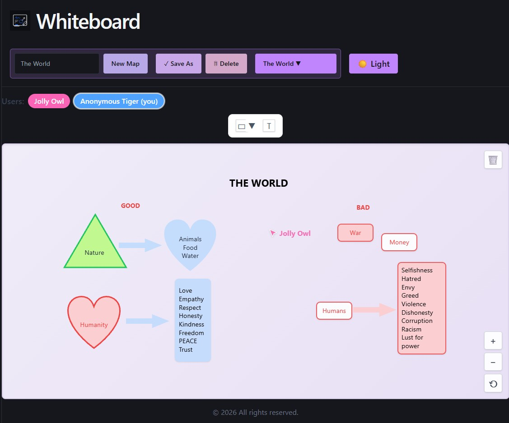
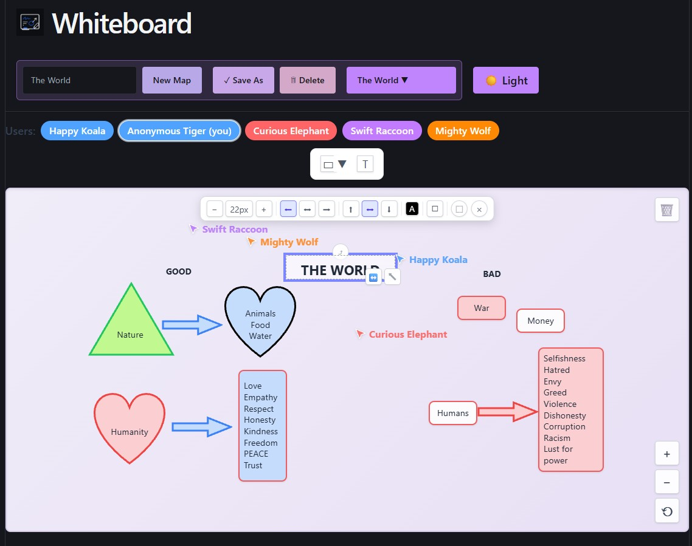
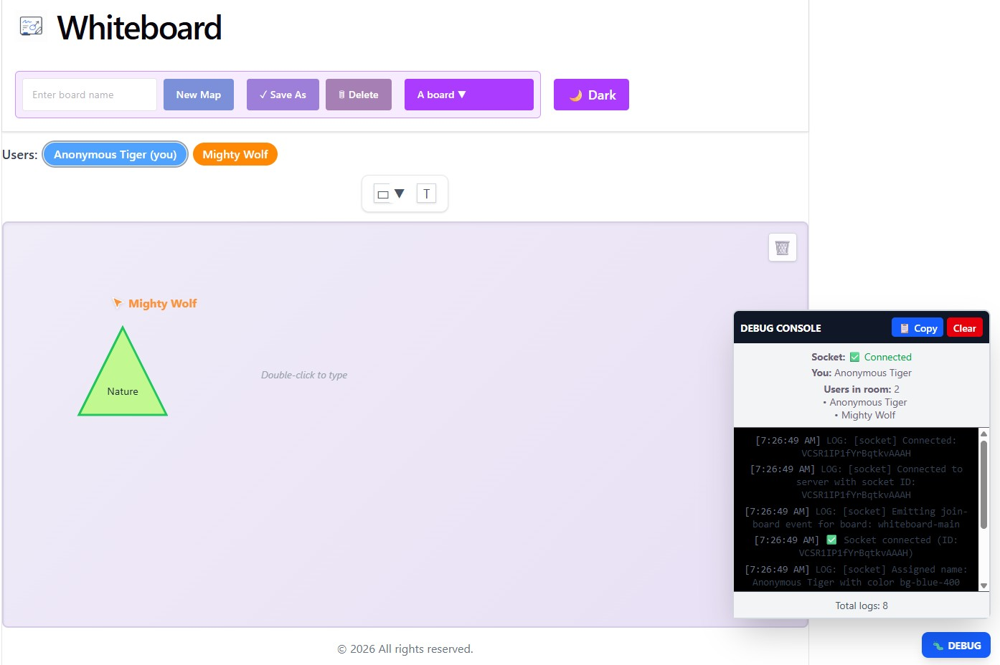

# Whiteboard 

A real-time collaborative whiteboard web application built to practice **React-Redux** state management and **WebSockets**, enabling multiple users to draw and interact together on the same canvas simultaneously.

## Features

- Real-time synchronization across multiple connected users via WebSockets
- Centralized application state managed with Redux
- Live cursor/interaction updates between participants
- MongoDB connection for persisting board data
- Debug panel for easier mobile debugging

## Screenshots

|  |  |
| ----------------------------------------------- | ----------------------------------------------- |
|  |

## Tech Stack

- **Frontend:** React, Redux
- **Backend:** Node.js, WebSockets
- **Database:** MongoDB

## Getting Started

```bash
# Clone the repository
git clone https://github.com/IsaVII/Whiteboard.git
cd Whiteboard

# Install backend dependencies
cd backend
npm install

# Install frontend dependencies
cd ../frontend
npm install
```

Run the backend and frontend servers separately, then open the app in your browser to start drawing collaboratively.

## Testing

This project includes a comprehensive test suite with automated GitHub Actions CI/CD.

### Quick Start
```bash
# Backend tests (Jest)
cd backend
npm test              # Run tests once
npm run test:watch   # Watch mode
npm run test:coverage # Coverage report

# Frontend tests (Vitest)
cd frontend
npm test              # Run tests once
npm run test:watch   # Watch mode
npm run test:coverage # Coverage report
```

### Test Coverage
- **Backend:** Utilities, Models, Controllers
- **Frontend:** Redux state management, API services
- **CI/CD:** Automated testing on push/pull requests

📚 **Full documentation:** See [TESTING.md](./TESTING.md) and [TEST_QUICKSTART.md](./TEST_QUICKSTART.md)

## Status

This project is a work in progress, built primarily as a learning exercise for React-Redux and WebSocket-based real-time multi-user interaction.
